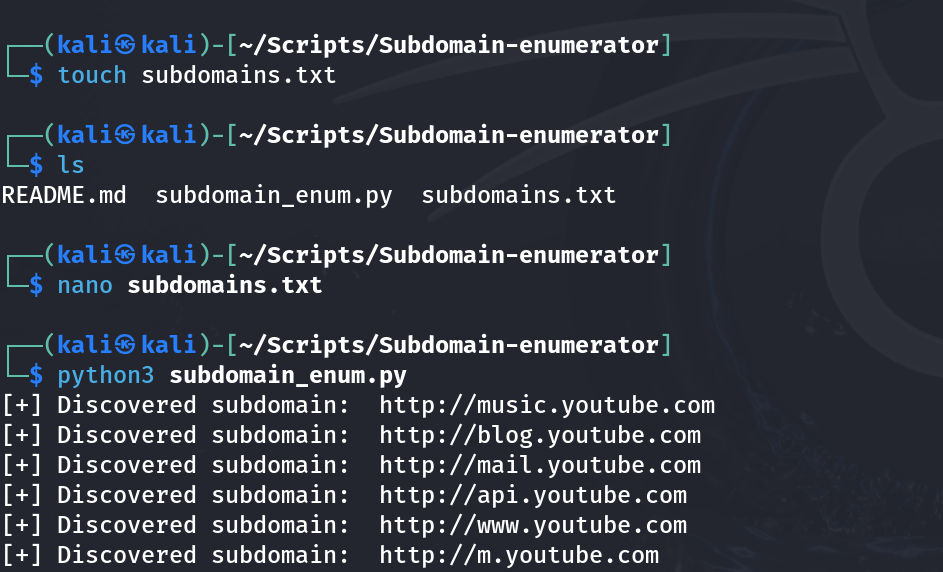

# Subdomain Enumerator

## Description

A Python-based subdomain enumeration tool that discovers active subdomains using multithreaded HTTP requests and a wordlist-based approach. Discovered subdomains are saved to an output file for further analysis.

## Features

- Wordlist-based subdomain enumeration
- Multi-threaded scanning
- HTTP response validation
- Automatic discovery reporting
- Saves results to a file
- Simple command-line execution

## Technologies Used

- Python 3
- Requests
- Threading

## Installation

```bash
git clone https://github.com/Vinaynagari795/Subdomain-enumerator.git
cd Subdomain-enumerator
```

## Requirements

```bash
pip install requests
```

## Usage

```bash
python3 subdomain_enumarator.py
```

Example:

```text
Domain: youtube.com
Wordlist: subdomains.txt
```

## Sample Output



Example:

```text
[+] Discovered subdomain: http://www.youtube.com
[+] Discovered subdomain: http://m.youtube.com
[+] Discovered subdomain: http://music.youtube.com
```

## Skills Demonstrated

- Subdomain Enumeration
- Reconnaissance
- Python Automation
- Multithreading
- Web Asset Discovery
- Information Gathering

## Project Structure

```text
Subdomain-enumerator/
├── subdomain_enum.py
├── README.md
└── screenshots/
    └── scan-result.png
```

## Disclaimer

This project was developed for educational purposes and authorized security testing only.

## Author

**Vinay Nagari**  
CEH | OSCP | CPENT
